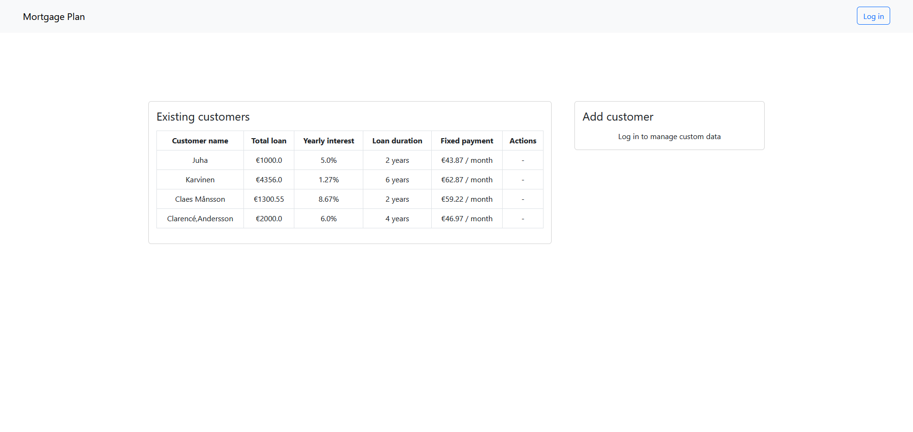

# Mortgage Plan

## Features

- Display and manage basic data about customers' mortgage plans
- Automatically calculate fixed monthly interest
- OIDC authentication through [auth0](https://auth0.com/)
- Web interface

## Demo

Deployed application can be accessed
at [https://mortgage-plan.dev.olafparfienczyk.com/](https://mortgage-plan.dev.olafparfienczyk.com/).

Screenshot:

## Tests

Unit and integration tests that amount to roughly 92% coverage.

## Compiling & Running

### Prerequisites

By default, the application listens on port `8080`.

It uses the in-memory H2 database, so any data will be lost after restart.

For the application to work Auth0 credentials need to be specified. It can be done either by directly overriding the
values in `src/main/resources/application.yaml` or by providing following environmental variables:

| Env. variable         | Description                            |
|-----------------------|----------------------------------------|
| `AUTH0_CLIENT_ID`     | Client id of the auth0 application     |
| `AUTH0_CLIENT_SECRET` | Client secret of the auth0 application |
| `AUTH0_ISSUER_URI`    | Issuer URI of the auth0 application    |

### Maven

Application uses Maven as a build tool. It can be built and tested using `mvn clean verify` command in the main
directory

Output jar is located in `target/` directory.

To run the application directly with maven, `mvn spring-boot:run` command can be used.

### Docker

There is a `Dockerfile` located in the main directory. It can be used to easily build the application as a docker image.

#### Building

Use the following command to build the image `docker build -t mortgage-plan .`.

#### Running

Use the following command to run the previously built image (replace environment variables with custom values):

`docker run -it -e AUTH0_CLIENT_ID=<client id> -e AUTH0_CLIENT_SECRET=<client secret> -e AUTH0_ISSUER_URI=<issuer uri> -p 8080:8080 mortgage-plan`.

The application will be accessible on `http://localhost:8080`.